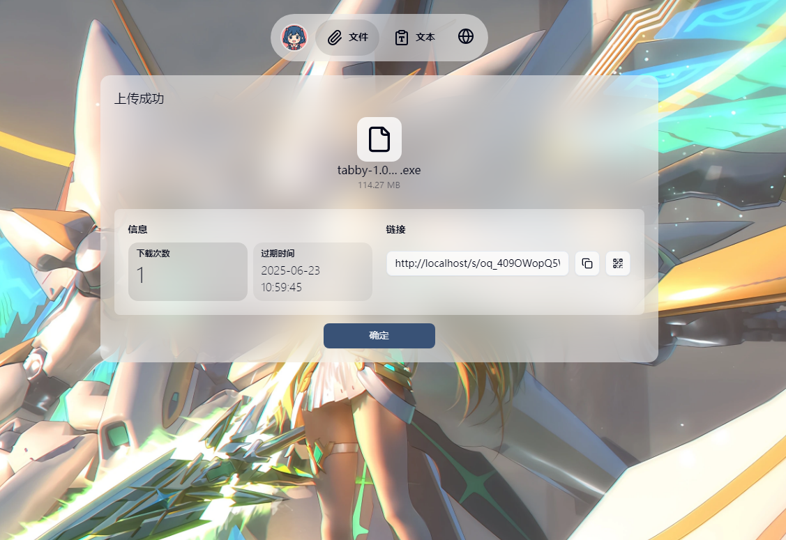

# 015

015 (/ˈzɪərəʊ wʌn faɪv/, "zero-one-five") 是一个支持selfhosted的临时文件分享平台。专注于提供一次性，临时的文件和文本上传，处理，分享服务。项目名称来源于DARLING in the FRANXX的 [莓](https://darling-in-the-franxx.fandom.com/wiki/Ichigo)

一个基于 Vue 3 + Nuxt 3 + Go 构建的现代文件分享网站，支持文件上传、文本分享、图片压缩、并发处理、秒传功能等，具备完整的分享管理和访问控制体系。


## 🌟 功能特性

### 核心功能

🖼️ **高性能文件上传** - 支持大文件切片上传，前端计算文件哈希实现秒传  
📱 **响应式设计** - 基于 Tailwind V4 + Reka UI 的现代化 UI，适配各种设备  
⚡ **并发处理** - 使用 Web Worker 进行前端Hash计算，后端队列系统处理任务  
🌐 **多语言支持** - 完整的中英文国际化支持  
🔗 **分享管理** - 灵活的分享链接生成和管理系统

### 文件处理

🔄 **智能秒传** - 基于文件哈希+文件大小的前端秒传检测，避免重复上传  
📷 **图片压缩** - 自动图片压缩功能，支持多种格式  
🖼️ **文件预览** - 支持图片、视频、音频、文档等多种文件类型预览  
📊 **上传统计** - 实时显示上传进度和文件信息  
🌈 **断点续传** - 支持上传中断后的续传功能

### 高级功能

🎛️ **分享控制** - 支持密码保护、下载次数限制、过期时间设置  
🔍 **取件码系统** - 支持取件码分享，简化分享难度  
⚡ **队列处理** - 基于 Redis + Asynq 的异步任务处理系统  
🗂️ **文件管理** - 完整的文件生命周期管理  
📷 **图片处理** - 图片压缩、格式转换等处理功能  
🏷️ **下载控制** - 基于 JWT 的下载令牌管理系统

## 截图





## 🏗️ 技术架构

### 前端技术栈

-   **Vue 3** - 渐进式 JavaScript 框架
-   **Nuxt 3** - Vue.js 全栈框架
-   **TypeScript** - 完整的类型安全
-   **Tailwind CSS** - 原子化 CSS 框架
-   **Reka UI** - 现代化组件库
-   **Pinia** - 状态管理
-   **TanStack Query** - 数据获取和缓存
-   **Vue Router** - 路由管理
-   **i18next** - 国际化支持

### 后端技术栈

-   **Go 1.23** - 高性能服务器端语言
-   **Echo** - 高性能 HTTP 框架
-   **Redis** - 缓存和会话存储
-   **Asynq** - 异步任务队列
-   **JWT** - 身份验证
-   **Zap** - 结构化日志

### 构建系统

-   **Node.js** - 服务器端运行时
-   **pnpm** - 快速包管理器
-   **Husky** - Git hooks 管理
-   **Prettier** - 代码格式化
-   **Lint-staged** - 暂存文件检查

### 存储架构

-   **文件存储** - 本地文件系统存储
-   **Redis 缓存** - 分享信息、文件元数据缓存
-   **队列系统** - 异步任务处理队列

## 🚀 快速开始

### 环境要求

-   Node.js 18+
-   Go 1.23+
-   Redis 6+
-   pnpm 9+

### 安装依赖

```bash
# 安装根目录依赖
pnpm install

# 安装前端依赖
cd front && pnpm install

# 安装后端依赖
cd backend && go mod download

# 安装 Worker 依赖
cd worker && go mod download
```

### 环境配置

```bash
# 复制环境变量文件
cp .env.example .env

# 配置必要的环境变量
REDIS_URL=redis://localhost:6379
UPLOAD_PATH=./uploads
download_secret=your_download_secret
```

### 启动服务

```bash
# 开发模式启动所有服务
pnpm run dev

# 或分别启动
pnpm run dev:front    # 前端服务 (端口 5000)
pnpm run dev:backend  # 后端服务 (端口 1323)
pnpm run dev:worker   # Worker 服务
```

## 📁 项目结构

```
015/
├── front/                 # 前端应用 (Vue 3 + Nuxt 3)
│   ├── components/       # Vue 组件
│   │   ├── pages/           # 页面路由
│   │   ├── composables/     # 组合式函数
│   │   ├── i18n/           # 国际化文件
│   │   └── assets/         # 静态资源
│   └── middleware/     # 中间件
├── backend/             # 后端服务 (Go + Echo)
│   ├── internal/       # 内部包
│   │   ├── controllers/ # 控制器
│   │   ├── models/     # 数据模型
│   │   ├── services/   # 业务逻辑
│   │   └── utils/      # 工具函数
│   └── middleware/     # 中间件
├── worker/             # 异步任务处理 (Go + Asynq)
│   ├── internal/       # 内部包
│   │   ├── tasks/      # 任务处理器
│   │   └── utils/      # 工具函数
│   └── middleware/     # 中间件
└── tmp/               # 临时文件
```

## 🔧 开发指南

### 代码规范

-   使用 Prettier 进行代码格式化
-   使用 Husky + lint-staged 进行提交前检查
-   遵循 TypeScript 类型安全规范

### 提交规范

```bash
# 提交前会自动运行代码格式化
git add .
git commit -m "feat: add new feature"
```

### 构建部署

```bash
# 构建前端
cd front && pnpm run build

# 构建后端 (需要 Go 环境)
cd backend && go build -o main .

# 构建 Worker
cd worker && go build -o worker .
```

## 📝 开发计划

### 已完成功能 ✅

-   前端计算哈希和秒传
-   并发切片上传 (使用 Web Worker)
-   文件上传/文本上传和分享
-   上传统计页面
-   多语言支持
-   最大上传限制
-   后端队列系统和 Worker 处理文件

### 计划功能 🚧

-   断点续传 (后端计算已上传部分并返回)
-   图片格式转换和压缩
-   图片 OCR 复制
-   文档转 Markdown
-   文本翻译/总结
-   支持上传多文件

## 🤝 贡献指南

欢迎提交 Issue 和 Pull Request 来改进这个项目。

## 📄 许可证

本项目采用 AGPLV3 许可证。

## 🔗 相关链接

-   [Vue 3 文档](https://vuejs.org/)
-   [Nuxt 3 文档](https://nuxt.com/)
-   [Echo 框架文档](https://echo.labstack.com/)
-   [Asynq 文档](https://github.com/hibiken/asynq)
